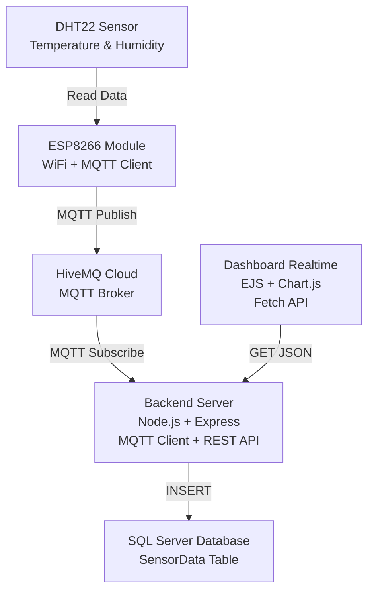

# 🌐 IoT Environmental Monitoring Dashboard

## 🇻🇳 README Tiếng Việt

Hệ thống giám sát môi trường gồm dashboard realtime, DHT22,ESP8266,HiveCloud, SQL Server

### 📁 Cấu trúc thư mục
(Đã được mô tả trong phần hướng dẫn trước.)

### ⚙️ Cài đặt & Chạy hệ thống
ESP8266 + DHT22
Nạp code Arduino cho ESP8266

Cấu hình MQTT Broker:

Host HiveMQ Cloud

Username / Password

Topic: sensor/dht22

Dữ liệu gửi định kỳ 5s → MQTT Broker
- `npm install`
- Tạo file `.env`
- Chạy backend: `node app.js`

### 🧭 Sơ đồ kiến trúc (Mermaid)

---

## 🇬🇧 README English Version

A real-time environmental monitoring system using DHT22 sensor, ESP8266, MQTT (HiveMQ Cloud), Node.js Backend, SQL Server, and Realtime Dashboard.

### ⚙️ Setup & Run
ESP8266 + DHT22

Flash Arduino code

Configure MQTT (HiveMQ Cloud)

Publish to topic sensor/dht22
- `npm install`
- Create `.env` file
- Run server: `node app.js`

### 🧭 Architecture Diagram (Mermaid)

